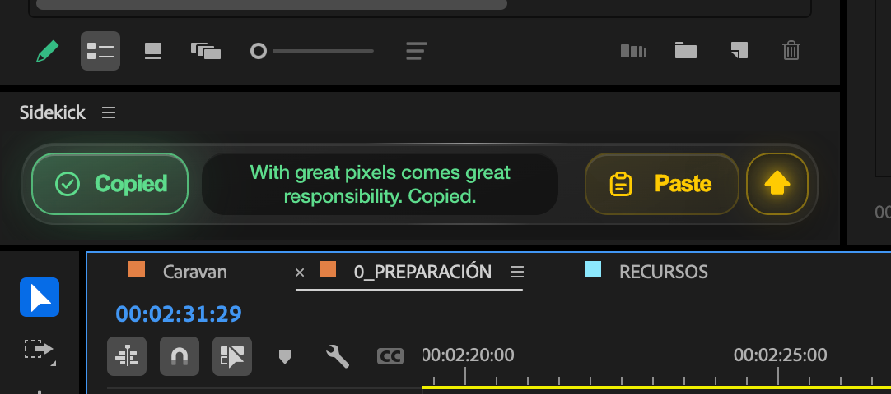

<h1 align="center">Sidekick</h1>

<p align="center">
  <b>Copy any frame. Paste any image. Straight onto your Premiere Pro timeline.</b><br>
  Premiere still won't let you copy and paste images. Sidekick does, in one click.
</p>

<p align="center">
  <a href="https://github.com/marquesdxp/sidekick/releases"></a>
  
  
  <a href="LICENSE"></a>
</p>

<p align="center">
  <a href="https://github.com/marquesdxp/sidekick/releases/latest"></a>
  &nbsp;
  <a href="#install"></a>
</p>

<p align="center">
  
</p>

<p align="center">
  <a href="https://www.buymeacoffee.com/marquesdxp"></a>
</p>

---

## What it does

Two buttons. That's the whole panel.

**Copy** grabs the frame under the playhead and puts it on the system clipboard
as an image. Paste it into Photoshop, Slack, an email, wherever.

**Paste** takes whatever image is on your clipboard, saves it in a `Sidekick`
folder next to your `.prproj`, imports it into a `Sidekick` bin and drops it at
the playhead. It never overwrites anything already on the timeline.

**Paste on top** (the arrow toggle, or **≡ → Paste on top**) changes where the
image lands:

| Mode | Behaviour |
|------|-----------|
| **Off** (default) | Fills the gap under the playhead on the first free video track. The image is trimmed to fit the gap, so it never eats the next clip. |
| **On** | Keeps the image at its full default duration and stacks it on the lowest track where it fits without touching anything. Creates a new track if none does. |

The toggle works like Caps Lock: it stays the way you leave it, across sessions.

**Paste folder** (**≡ → Paste folder**) is where pasted images are saved. By
default a `Sidekick` folder next to the `.prproj`. Pick any other folder and
it's remembered relative to the project when possible, so `../IMAGES` works
the same on every project that shares your folder structure, and on every
machine. A folder on another drive is kept absolute.

**Three languages.** English, Spanish and Brazilian Portuguese, picked from
**≡ → Language** and remembered in `sidekick.json` in your user data folder
(`~/Library/Application Support` on macOS, `%APPDATA%` on Windows). Anything not translated
falls back to English. Every confirmation is a movie quote; click it to reveal
the film.

## Install

Requires Premiere Pro 15 or later. Same `.zxp` for macOS and Windows.

1. Download **`Sidekick-x.y.z.zxp`** from the [latest release](https://github.com/marquesdxp/sidekick/releases/latest).
2. Install [ZXP Installer](https://aescripts.com/learn/zxp-installer/) (free, macOS and Windows) if you don't have it.
3. Quit Premiere Pro, open ZXP Installer and drag the `.zxp` into it.
4. Start Premiere Pro and open **Window → Extensions → Sidekick**.

Where it ends up, in case you ever want to remove it by hand:

| | Extension folder |
|---|---|
| **macOS** | `~/Library/Application Support/Adobe/CEP/extensions/com.andersonmarques.sidekick` |
| **Windows** | `%APPDATA%\Adobe\CEP\extensions\com.andersonmarques.sidekick` |

**Without a ZXP:** clone the repository and double-click **`install.command`**
(macOS) or **`install.bat`** (Windows). It copies the panel into the folder
above and lets Premiere load it. On macOS, if Gatekeeper refuses to open the script, right-click it
and choose **Open**.

## Development

```sh
./install.command --link   # symlinks instead of copies: edit, then ≡ → Refresh
npm test                   # clipboard, i18n, quotes and path checks
./build.command            # signs dist/Sidekick-x.y.z.zxp
```

Building the `.zxp` needs `ZXPSignCmd` (from Adobe's
[CEP-Resources](https://github.com/Adobe-CEP/CEP-Resources), `ZXPSignCMD/`
folder) in `tools/`. A self-signed certificate is created on the first run and
never committed. The panel's console is at `http://localhost:8099`.

## How it works

The clipboard is driven through the operating system, not `navigator.clipboard`:
JXA over `NSPasteboard` on macOS, PowerShell on Windows, both launched with
`cep.process`. The CEF embedded in Premiere denies clipboard reads and
`ClipboardItem` isn't always there.

Pasted files live next to the project and **never in a temp folder**: Premiere
links to the file forever, and a temp file would eventually go offline.

Frame export goes through QE (`qe.project…exportFramePNG`), Premiere's internal
DOM, because newer versions no longer expose `exportFrame*` to scripts. If QE is
ever gone too, `renderVideoFrameAtTime` and the four `exportFrame*` calls are
tried as fallbacks, and the panel reports what that version offers.

The default language comes from `navigator.language`, which inside Premiere's
CEF is **Premiere's** language, not the system's. That's why the menu overrides
it.

## Known limits

- CEP is deprecated by Adobe. It still works, and it's the only way to reach
  the disk and the clipboard without UXP's restrictions.
- Paste needs a saved project: without a `.prproj` on disk there's no folder to
  put the image in (unless you set an absolute paste folder).

## Found a bug? Have an idea?

[Open an issue](https://github.com/marquesdxp/sidekick/issues). Say which
Premiere version and OS you're on, and paste anything the panel's console
shows (`http://localhost:8099` while Premiere is running). Feature requests are
welcome too.

## License

MIT. See [LICENSE](LICENSE).
